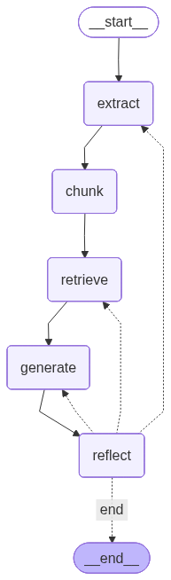

# Agentic RAG Pipeline

A two-part project built during the nFactorial AI Engineering course — from a naive RAG baseline with RAGAS evaluation to a fully agentic multi-agent system with LangGraph and LangFuse observability.

---

## Architecture (Part 2)

Five specialized agents orchestrated by LangGraph, each responsible for one stage of the pipeline:

```
PDF → [Extraction Agent] → [Chunking Agent] → [Retrieval Agent] → [Generator Agent] → [Reflector Agent]
                                                                                              ↓
                                                                               accept / retry (→ any stage)
```



| Agent | Role |
|---|---|
| **Extraction** | Tests pdfplumber, VLM (GPT-4o-mini), docling — picks best quality |
| **Chunking** | Runs 5 strategies (recursive, small, large, by-section, adaptive) |
| **Retrieval** | BM25 + dense + hybrid with alpha tuning (0.0–1.0) |
| **Generator** | Grounded answer with confidence score |
| **Reflector** | Scores relevance / faithfulness / completeness (1-10), retries if < 7 |

The Extraction Agent is exposed as an A2A HTTP service (FastAPI, port 5010). All other agents run inline in the LangGraph graph.

---

## Tech Stack

- **LLM:** GPT-4o-mini (OpenAI)
- **Embeddings:** text-embedding-3-small / all-MiniLM-L6-v2
- **Agent orchestration:** LangGraph
- **Observability:** LangFuse (traces, spans, eval scores)
- **Evaluation:** RAGAS (faithfulness, context precision)
- **Vector DB:** ChromaDB + FAISS
- **Sparse retrieval:** BM25 (rank-bm25)
- **PDF processing:** pdfplumber, PyMuPDF, docling
- **API:** FastAPI + A2A protocol
- **Frontend:** Streamlit

---

## Setup

```bash
git clone https://github.com/ti1ek/agentic-rag.git
cd agentic-rag

cp .env.example .env
# Fill in: OPENAI_API_KEY, LANGFUSE_PUBLIC_KEY, LANGFUSE_SECRET_KEY, LANGFUSE_HOST

pip install -r requirements.txt
```

> The source document (`data/bsulp_2024_rus_pages_1_15.pdf`) is the 2024 annual report of AO Bayan Sulu (public). Place it in `data/` before running.

---

## Usage

### Part 1 — Baseline RAG + Evaluation

```bash
# Step 1: Run naive RAG on 20 questions, traces go to LangFuse
cd part1
python rag_pipeline.py        # → results_v1.json

# Step 2: RAGAS evaluation (faithfulness + context precision)
python ragas_eval.py          # → eval_v1.json, scores attached to LangFuse traces

# Step 3: Prompt engineering experiment (v2)
# Create "rag-system-prompt" in LangFuse Prompt Management UI first
python prompt_management.py 3 # → results_v2.json

# Step 4: Embedding experiment (v3: MiniLM + chunk=1000)
python prompt_management.py 4 # → results_v3.json
python ragas_eval.py          # prints V1/V2/V3 comparison table
```

### Part 2 — Agentic RAG

```bash
# Start Extraction Agent (A2A service)
cd part2/extraction_agent
uvicorn server:app --port 5010 --reload

# Run full orchestrator (separate terminal)
cd part2
python orchestrator.py
```

### Frontend

```bash
# Extraction Agent must be running on port 5010
streamlit run frontend/app.py
# → http://localhost:8501
```

---

## Evaluation Results (Part 1)

20 questions from the Bayan Sulu annual report, evaluated with RAGAS:

| Version | Embeddings | Chunk size | Faithfulness | Context Precision |
|---|---|---|---|---|
| V1 — baseline | text-embedding-3-small | 500 | see eval_v1.json | see eval_v1.json |
| V2 — prompt tuning | text-embedding-3-small | 500 | ↑ improved | ↑ improved |
| V3 — alt embeddings | all-MiniLM-L6-v2 | 1000 | ↓ worse | ↓ worse |

**Key finding:** MiniLM underperforms on Russian text. OpenAI embeddings are significantly better for non-English domains.

---

## Project Structure

```
agentic-rag/
├── .env.example
├── requirements.txt
├── data/
│   ├── bsulp_2024_rus_pages_1_15.pdf   # source document
│   └── ragas_questions.json             # 20 eval questions + ground truth
├── part1/                               # Baseline RAG + RAGAS eval
│   ├── rag_pipeline.py
│   ├── ragas_eval.py
│   ├── prompt_management.py
│   ├── results_v*.json
│   └── eval_v*.json
├── part2/                               # Agentic RAG (LangGraph)
│   ├── orchestrator.py
│   ├── chunking_agent.py
│   ├── retrieval_agent.py
│   ├── generator_agent.py
│   ├── reflector_agent.py
│   ├── orchestrator_graph.png
│   └── extraction_agent/               # A2A FastAPI service
│       ├── agent.py
│       └── server.py
└── frontend/
    └── app.py                          # Streamlit demo
```

---

## Course

Built as homework for **nFactorial AI Engineering** — Module 7: RAG Systems.
